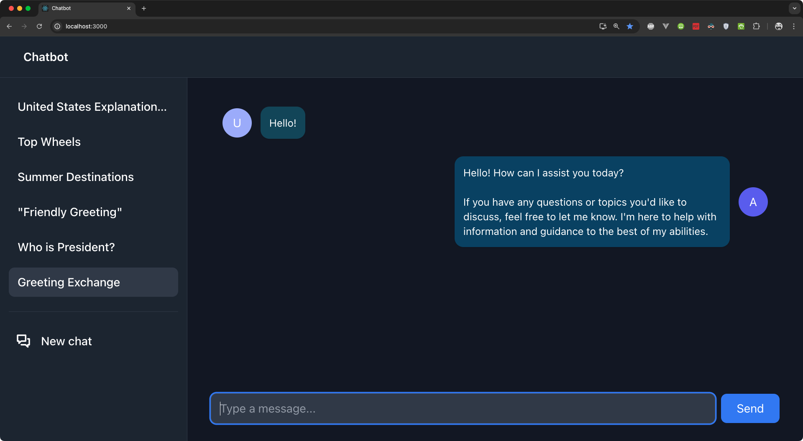

# React Tailwind Chatbot Client

A practical example of building a chatbot front-end app using React and Tailwind.

The client provides a UI for creating new chats or accessing existing ones from the sidebar. This project demonstrates creating responsive chat bubbles, an input form, and auto-scrolling to the latest message when a new one is received from the bot.

 

    

 

The REST API is flexible and requires additional backend deployment. The entire chatbot application is based on the [`serverless-amazon-bedrock-fastapi`](https://github.com/mrnexeon/serverless-amazon-bedrock-fastapi), a serverless backend deployed as an AWS Lambda function.

 

    <picture>
        <source media="(prefers-color-scheme: dark)" srcset="docs/diagram-dark.png">
        <source media="(prefers-color-scheme: light)" srcset="docs/diagram.png">
        
    </picture>

 

## Usage

In the project directory, you can run:

### `npm start`

Runs the app in the development mode.\
Open [http://localhost:3000](http://localhost:3000) to view it in your browser.

### `npm run build`

Builds the app for production to the `build` folder.\
It correctly bundles React in production mode and optimizes the build for the best performance.

## Deployment

You can utilize Amazon Amplify Hosting to easily deploy this client. Follow the Amplify instructions by the [link](https://aws.amazon.com/getting-started/hands-on/build-react-app-amplify-graphql/module-one/).

Specify the `REACT_APP_RESTAPI_ENDPOINT` variable to your deployed [serverless-amazon-bedrock-fastapi](https://github.com/mrnexeon/serverless-amazon-bedrock-fastapi) backend.